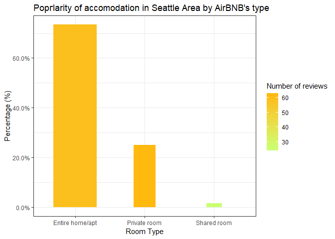
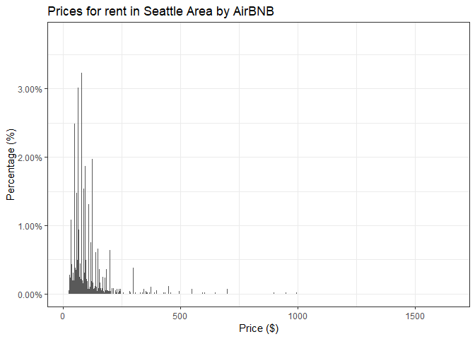
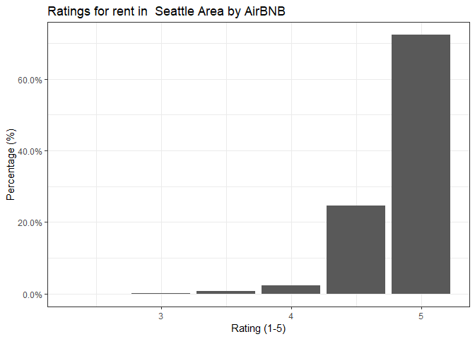

Індивідульна робота. Аналіз показників житла для короткострокової оренди на прикладі AirBnb
================

Набір даних
-----------

У завданні було використано набір даних, що містить список нерухомості для короткострокової оренди у Сієтлі та прилеглих околицях (<https://www.kaggle.com/shanelev/seattle-airbnb-listings>).

Аналіз може допомогти у кращому розумінні про те, які показники впливають на якість нерухомості та як формуэться ціна

Хід роботи
----------

### Підгтовка вхідних даних

**1.** Використовуємо бібліотеку tidyverse та scales, що містить корисні функції для аналізу даних та побудови графіків

``` r
library(tidyverse)
library(scales)
```

**2.** Зчитуємо файл формату csv та подиимось на кількість записів містять дані

``` r
airbnb_data <- read.csv('seattle_01.csv')

nrow(airbnb_data)
```

    ## [1] 7576

**3.** Подивимось на підсумкові результати різних властивостей даних

``` r
summary(airbnb_data)
```

    ##        X           room_id            host_id         
    ##  Min.   :   0   Min.   :    2318   Min.   :     2536  
    ##  1st Qu.:1982   1st Qu.:11212139   1st Qu.:  8315334  
    ##  Median :3970   Median :19608238   Median : 26967583  
    ##  Mean   :3974   Mean   :17789280   Mean   : 52450396  
    ##  3rd Qu.:5945   3rd Qu.:24844800   3rd Qu.: 80739602  
    ##  Max.   :7974   Max.   :30998418   Max.   :231435350  
    ##                                                       
    ##            room_type                                address    
    ##  Entire home/apt:5603   Seattle, WA, United States      :6710  
    ##  Private room   :1844   Bellevue, WA, United States     : 322  
    ##  Shared room    : 129   Kirkland, WA, United States     : 200  
    ##                         Redmond, WA, United States      : 110  
    ##                         Seattle, United States          :  70  
    ##                         Mercer Island, WA, United States:  50  
    ##                         (Other)                         : 114  
    ##     reviews       overall_satisfaction  accommodates       bedrooms    
    ##  Min.   :  0.00   Min.   :2.500        Min.   : 1.000   Min.   :0.000  
    ##  1st Qu.:  4.00   1st Qu.:4.500        1st Qu.: 2.000   1st Qu.:1.000  
    ##  Median : 21.00   Median :5.000        Median : 3.000   Median :1.000  
    ##  Mean   : 47.66   Mean   :4.841        Mean   : 3.683   Mean   :1.385  
    ##  3rd Qu.: 64.00   3rd Qu.:5.000        3rd Qu.: 4.000   3rd Qu.:2.000  
    ##  Max.   :687.00   Max.   :5.000        Max.   :28.000   Max.   :8.000  
    ##                   NA's   :1473                                         
    ##    bathrooms         price                         last_modified 
    ##  Min.   :0.000   Min.   :  15   2018-12-20 02:51:45.228369:   1  
    ##  1st Qu.:1.000   1st Qu.:  65   2018-12-20 02:51:47.693335:   1  
    ##  Median :1.000   Median :  88   2018-12-20 02:51:47.694356:   1  
    ##  Mean   :1.307   Mean   : 113   2018-12-20 02:51:47.695142:   1  
    ##  3rd Qu.:1.500   3rd Qu.: 125   2018-12-20 02:51:47.695948:   1  
    ##  Max.   :8.000   Max.   :5900   2018-12-20 02:51:47.696722:   1  
    ##  NA's   :2                      (Other)                   :7570  
    ##     latitude       longitude     
    ##  Min.   :47.51   Min.   :-122.4  
    ##  1st Qu.:47.60   1st Qu.:-122.4  
    ##  Median :47.62   Median :-122.3  
    ##  Mean   :47.62   Mean   :-122.3  
    ##  3rd Qu.:47.66   3rd Qu.:-122.3  
    ##  Max.   :47.72   Max.   :-122.1  
    ##                                  
    ##                                                location   
    ##  0101000020E6100000A1866F61DD955EC01E17D522A2D04740:  38  
    ##  0101000020E610000029417FA147955EC0C619C39CA0CF4740:  32  
    ##  0101000020E610000021020EA14A945EC0A950DD5CFCCF4740:  15  
    ##  0101000020E610000052465C001A955EC0E9279CDD5ACE4740:  11  
    ##  0101000020E610000062A3ACDF4C955EC0CCD3B9A294CE4740:  10  
    ##  0101000020E610000069E21DE049945EC0AE0D15E3FCCF4740:  10  
    ##  (Other)                                           :7460  
    ##                                                   name      currency  
    ##  Domicile – New Premium Apt Near Amzn - Chroma SLU:  24   USD:7576  
    ##  Executive Apt near Facebk/Amzn/Goog                :  24             
    ##  Executive Apt near Facebk/Amzn/Goog w/City View    :  12             
    ##  Luxury Downtown (100 Walkscore) 1BD by Amazon      :  12             
    ##  1 First Hill Open 1br xx                           :  10             
    ##  Capital Hill Apartments xx                         :  10             
    ##  (Other)                                            :7484             
    ##    rate_type   
    ##  nightly:7576  
    ##                
    ##                
    ##                
    ##                
    ##                
    ## 

**4.** Бачимо, що показник overall\_satisfaction - 5-зірковий рейтинг, що використовується орендаторами для оцінки житла, має багато значень NA. Ці дані нам непотрбні, тому почистимо їх та подивимось, які дані ми маємо та cкільки записів залишилось

``` r
airbnb_data <- airbnb_data[!is.na(airbnb_data$overall_satisfaction),]

nrow(airbnb_data)
```

    ## [1] 6103

``` r
head(airbnb_data, 10)
```

    ##     X room_id host_id       room_type                    address reviews
    ## 1   0    2318    2536 Entire home/apt Seattle, WA, United States      21
    ## 3   2    4291   35749    Private room Seattle, WA, United States      63
    ## 4   3    5682    8993 Entire home/apt Seattle, WA, United States     462
    ## 5   4    6606   14942 Entire home/apt Seattle, WA, United States     134
    ## 6   5    9419   30559    Private room Seattle, WA, United States     130
    ## 7   6    9460   30832    Private room Seattle, WA, United States     401
    ## 8   7    9531   31481 Entire home/apt Seattle, WA, United States      35
    ## 9   8    9534   31481 Entire home/apt Seattle, WA, United States      36
    ## 10  9    9596   14942 Entire home/apt Seattle, WA, United States      76
    ## 11 10    9909   33360 Entire home/apt Seattle, WA, United States      57
    ##    overall_satisfaction accommodates bedrooms bathrooms price
    ## 1                   5.0            8        4       2.5   250
    ## 3                   4.5            2        1       1.0    82
    ## 4                   5.0            2        0       1.0    49
    ## 5                   4.5            2        1       1.0    90
    ## 6                   4.5            2        1       3.0    65
    ## 7                   5.0            2        1       1.0    78
    ## 8                   5.0            4        2       1.0   165
    ## 9                   5.0            3        2       1.0    95
    ## 10                  4.5            4        1       1.0   115
    ## 11                  5.0            4        2       1.0   135
    ##                 last_modified latitude longitude
    ## 1  2018-12-20 03:46:14.698548 47.61082 -122.2908
    ## 3  2018-12-20 03:04:19.861014 47.68780 -122.3134
    ## 4  2018-12-20 04:11:25.482975 47.52398 -122.3599
    ## 5  2018-12-20 03:12:38.391711 47.65411 -122.3376
    ## 6  2018-12-20 04:08:20.099202 47.55017 -122.3194
    ## 7  2018-12-20 03:45:03.853262 47.60801 -122.3287
    ## 8  2018-12-20 04:12:23.644451 47.55539 -122.3847
    ## 9  2018-12-20 04:11:31.085822 47.55624 -122.3860
    ## 10 2018-12-20 03:15:01.176545 47.65479 -122.3365
    ## 11 2018-12-20 04:05:07.397353 47.56612 -122.3727
    ##                                              location
    ## 1  0101000020E6100000D449B6BA9C925EC0416326512FCE4740
    ## 3  0101000020E6100000BDAB1E300F945EC0FB93F8DC09D84740
    ## 4  0101000020E6100000FCC7427408975EC009E1D1C611C34740
    ## 5  0101000020E6100000D47D00529B955EC07782FDD7B9D34740
    ## 6  0101000020E6100000145D177E70945EC0522B4CDF6BC64740
    ## 7  0101000020E6100000DD7A4D0F0A955EC00BD28C45D3CD4740
    ## 8  0101000020E6100000BA9F53909F985EC071C79BFC16C74740
    ## 9  0101000020E610000027F8A6E9B3985EC0CE6DC2BD32C74740
    ## 10 0101000020E6100000CB9C2E8B89955EC0486C770FD0D34740
    ## 11 0101000020E61000009C1727BEDA975EC046CEC29E76C84740
    ##                                                  name currency rate_type
    ## 1  Casa Madrona - Urban Oasis, 1 block from the Park!      USD   nightly
    ## 3                     Sunrise in Seattle Master Suite      USD   nightly
    ## 4                 Cozy Studio, min. to downtown -WiFi      USD   nightly
    ## 5                 Fab, private seattle urban cottage!      USD   nightly
    ## 6                 Glorious sun room w/ memory foambed      USD   nightly
    ## 7                 Downtown/Convention Ctr B&B - Nice!      USD   nightly
    ## 8                 The Adorable Sweet Orange Craftsman      USD   nightly
    ## 9                   The Coolest Tangerine Dream MIL!       USD   nightly
    ## 10         the down home , spacious, central and fab!      USD   nightly
    ## 11                     Luna Park Lower - West Seattle      USD   nightly

``` r
tail(airbnb_data, 10)
```

    ##         X  room_id   host_id       room_type                     address
    ## 7330 7719 30155968 226567512 Entire home/apt  Seattle, WA, United States
    ## 7331 7720 30156217 224495142    Private room  Seattle, WA, United States
    ## 7332 7721 30159056  26316496 Entire home/apt  Seattle, WA, United States
    ## 7335 7724 30179277  75997715    Private room Bellevue, WA, United States
    ## 7353 7742 30261132 215426444    Private room  Seattle, WA, United States
    ## 7360 7749 30270357  18988566 Entire home/apt  Seattle, WA, United States
    ## 7364 7753 30288568  92257724 Entire home/apt  Seattle, WA, United States
    ## 7395 7785 30378325  45163577 Entire home/apt  Seattle, WA, United States
    ## 7418 7809 30425089   4729068 Entire home/apt  Seattle, WA, United States
    ## 7426 7818 30444838 228426420 Entire home/apt  Seattle, WA, United States
    ##      reviews overall_satisfaction accommodates bedrooms bathrooms price
    ## 7330       3                    4            2        0       1.0    29
    ## 7331       3                    5            2        1       1.0    48
    ## 7332       3                    5            5        2       1.0    99
    ## 7335       4                    5            2        1       1.0    45
    ## 7353       4                    5            2        1       1.0    28
    ## 7360       4                    5            6        3       2.0    69
    ## 7364       3                    5            6        2       2.5   140
    ## 7395       3                    4            2        1       1.0    41
    ## 7418       6                    5            2        1       1.0    65
    ## 7426       3                    5            3        1       1.0    79
    ##                   last_modified latitude longitude
    ## 7330  2018-12-20 02:58:36.95968 47.69255 -122.3425
    ## 7331 2018-12-20 02:52:59.311645 47.52727 -122.2748
    ## 7332  2018-12-20 03:15:37.09888 47.62310 -122.3094
    ## 7335  2018-12-20 03:38:54.03632 47.60748 -122.1283
    ## 7353 2018-12-20 02:51:59.121565 47.57408 -122.2949
    ## 7360 2018-12-20 03:46:03.131395 47.61246 -122.3024
    ## 7364 2018-12-20 03:51:01.491888 47.60561 -122.3146
    ## 7395 2018-12-20 02:59:51.427367 47.69367 -122.3455
    ## 7418 2018-12-20 02:52:17.353294 47.53305 -122.3526
    ## 7426  2018-12-20 04:03:16.74221 47.57187 -122.3137
    ##                                                location
    ## 7330 0101000020E6100000CFD90242EB955EC0645B069CA5D84740
    ## 7331 0101000020E6100000A795422097915EC05B0C1EA67DC34740
    ## 7332 0101000020E610000002F4FBFECD935EC09D11A5BDC1CF4740
    ## 7335 0101000020E6100000FC6F253B36885EC0C0E78711C2CD4740
    ## 7353 0101000020E61000000518963FDF925EC0C139234A7BC94740
    ## 7360 0101000020E61000004EED0C535B935EC07905A22765CE4740
    ## 7364 0101000020E61000001E705D3123945EC07521567F84CD4740
    ## 7395 0101000020E6100000B0E600C11C965EC09FB0C403CAD84740
    ## 7418 0101000020E6100000923D42CD90965EC041800C1D3BC44740
    ## 7426 0101000020E6100000A9A44E4013945EC0514CDE0033C94740
    ##                                                       name currency
    ## 7330         Quaint suite less than a mile from Green Lake      USD
    ## 7331    MidCentury/Bath/Kitchenette/ Easy DT SeaTac Access      USD
    ## 7332   Historic Capitol Hill home is a walkerвЂ\231s paradise      USD
    ## 7335     Private entrance w/ kitchenette & Coffee Service.      USD
    ## 7353 Bed&Bath Free Parking W LR STA Airport DT UW (дё­ж–‡)      USD
    ## 7360                                 3 Bedroom Urban Oasis      USD
    ## 7364           City oasis in the heart of the Capitol Hill      USD
    ## 7395                               Georgian Properties "5"      USD
    ## 7418                      Cute and Comfortable Guest Suite      USD
    ## 7426                            Jefferson Park cozy living      USD
    ##      rate_type
    ## 7330   nightly
    ## 7331   nightly
    ## 7332   nightly
    ## 7335   nightly
    ## 7353   nightly
    ## 7360   nightly
    ## 7364   nightly
    ## 7395   nightly
    ## 7418   nightly
    ## 7426   nightly

### Аналіз типу житла

**5.** Спочтку проаналізуємо, як тип житла стосується ціни, рейтингів і відгуків. AirBnb ділить житл за такими типами: \* Entire home/apartment - весь будинок або квартира \* Private room - окрема кімната \* Shared room - спільна кімната

``` r
grouped_by_type <- group_by(airbnb_data, room_type)

room_types <- summarize(grouped_by_type, 
              count = n(), 
              price = mean(price, na.rm = T), 
              reviews = mean(reviews, na.rm = T), 
              ratings = mean(overall_satisfaction, na.rm=T))

room_types
```

    ## # A tibble: 3 x 5
    ##   room_type       count price reviews ratings
    ##   <fct>           <int> <dbl>   <dbl>   <dbl>
    ## 1 Entire home/apt  4482 124.     58.7    4.84
    ## 2 Private room     1531  61.7    62.0    4.85
    ## 3 Shared room        90  45.1    25.1    4.61

``` r
ggplot(data = room_types) +
geom_col(aes(x = room_type, 
             y = (count / sum(count)), 
             fill = reviews, 
             width = price / 200)) +
labs(title = 'Popгlarity of accomodation in Seattle Area by AirBNB\'s type',
     x = 'Room Type',
     y = 'Percentage (%)',
     fill = 'Number of reviews') +
scale_fill_gradient(low = "darkolivegreen1", high = "darkgoldenrod1") +
scale_y_continuous(labels = percent) +
theme_bw()
```



Отже, при середній ціні близько 130 доларів, найдорожчим і найпоширенішим варіантом є вся квартира/будинок. Середня ціна для приватних кімнат становить приблизно половину ціни повної квартири/будинку. Приватні номери мають в середньому трохи більше відгуків, а середні рейтинги - від 4,5 до 5, що свідчить про те, що більшість відгуків є 5-зірковими.

### Аналіз адрес

**6.** Для того, шоб дізнатися в яких саме містах розташована нерухомість, додамо колонку до даних "city". Виберемо назву міста з адреси.

``` r
separated <- separate(airbnb_data, address, c('city'), sep = ',', remove = F, extra = 'drop') 
airbnb_data <- mutate(separated, city = str_trim(city, 'both'))

unique(airbnb_data$city)
```

    ##  [1] "Seattle"         "Kirkland"        "Bellevue"       
    ##  [4] "Redmond"         "Mercer Island"   "Renton"         
    ##  [7] "Ballard"         "West Seattle"    "Medina"         
    ## [10] "西雅图"       "Newcastle"       "Ballard Seattle"
    ## [13] "Yarrow Point"    "Clyde Hill"      "Tukwila"        
    ## [16] "Capitol Hill"    "Hunts Point"

Один із записів закодований іншою мовою, тому зараз ми можемо відмовитися від цієї цього запису.

**7.** У регіоні вказано цілий ряд районів і міст, але ми повинні перевірити, як вони розподвляються у наборі даних та чи можуть представляють весь регіон.

``` r
grouped_by_city <- group_by(airbnb_data, city)
city_data = arrange(summarise(grouped_by_city, count=n()), desc(count))

n <- 2
city_data <- filter(city_data, count > n)

city_data
```

    ## # A tibble: 7 x 2
    ##   city          count
    ##   <chr>         <int>
    ## 1 Seattle        5503
    ## 2 Bellevue        241
    ## 3 Kirkland        157
    ## 4 Redmond          78
    ## 5 Newcastle        42
    ## 6 Mercer Island    38
    ## 7 Renton           32

Отже, вибірка замістами не є репрезентативною, для того, щоб порівнювати ціни та рейтинги, оскільки переважна більшість житла знаходяться в Сіетлі, тазалишаються лише з декілька адресами, які включають передмістя або околиці.

### Аналіз ціни та рейтингу

**8.** Подивимось як розподілені ціна за оренду житла у регіоні

``` r
ggplot(data = subset(airbnb_data, currency == 'USD'), aes(x = price)) +
    geom_bar(aes(y = (..count..)/sum(..count..))) +
    scale_y_continuous(labels=percent) +
    labs(title = 'Prices for rent in Seattle Area by AirBNB', 
         x = 'Price ($)', 
         y = 'Percentage (%)') +
    theme_bw()
```



Розподіл цін зарактеризується скупченням у районі до 250$. Можемо зробити попередній висновок, що між ціною та якістю немає чіткого зв'язку, оскільки високі ціни будуть набагато вищими, ніж середні показники розподілу, але оцінюватимуться лише за тією ж 5-бальною шкалою.

**9.** Подивимось як розподілені рейтинги житла у регіоні

``` r
ggplot(data = subset(airbnb_data, !is.na(overall_satisfaction)), aes(x = overall_satisfaction)) + 
    geom_bar(aes(y = (..count..)/sum(..count..))) + 
    scale_y_continuous(labels = percent) + 
    labs(title = 'Ratings for rent in  Seattle Area by AirBNB', 
         x = 'Rating (1-5)', 
         y = 'Percentage (%)') +
    theme_bw()
```



Переважна більшість оцінок - 5 зірок. Враховуючи, що в багатьох місцях є 5-зіркові рейтинги, важко знайти помітні відмінності в якості досвіду.

Висновки
--------

-   Незважаючи на вищц ціну весь будинок або квартира - найпоширеніший вид жита
-   Переважна частина житла розташована у місті Сієнтлі, далі - Белвью, потім інші маленькі міста
-   На ринку переважає житло з середніми значенням 113$ за ніч з більшістю пропозицій до 250$
-   Рейтинги житла переважно максимальні (5 зірок)

Куди рухатись далі? У перспективі можна проаналізувати вплив інших показників на формування ціни (наприклад, кількості відгуків, кількіть спален та ванних кімнат тощо)
